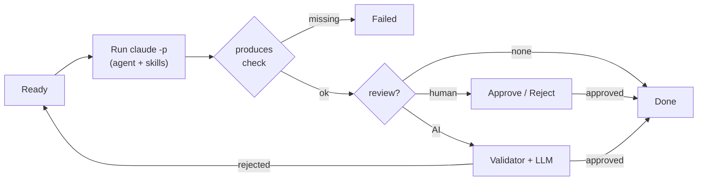

# AI StepFlow

A **Claude flow cockpit for VS Code**. Keep your Claude agents, skills, and
multi-step workflows in one place — then run each step through the Claude CLI
without leaving the editor.


## What it does

- **One cockpit** — browse global (`~/.claude`) and project (`.claude`) agents,
  skills, and flows side by side, filter by scope or tag.
- **Visual flow builder** — build multi-step flows: assign an agent + skills per
  step, declare inputs, set dependencies, drag to reorder.
- **Step runner** — each step runs as one headless `claude -p` process and streams
  its output into the console.
- **Review gates** — gate a step on a human approve/reject or an automated AI
  review (deterministic validator + optional LLM pass).
- **Artifact gates** — `requires` / `produces` / `producesContains` checks block a
  step from starting or finishing unless the expected files and markers exist.
- **Run persistence** — in-progress runs are saved per project and restored on
  reload.
- **Headless CLI** — drive a flow from scripts or CI, human gates included.
- **GitNexus integration** *(optional)* — build/refresh a repo knowledge graph and
  manage multi-repo groups from **Project Settings**.

## Requirements

[Claude Code CLI](https://docs.anthropic.com/en/docs/claude-code) on your `PATH`:

```sh
npm install -g @anthropic-ai/claude-code
```

## Getting started

1. Open the **AI StepFlow** icon in the activity bar (or run **Open AI StepFlow**).
2. Pick a flow and press **Run**, or create one with **+ New Flow**.
3. Run each step from the runner panel and review the streamed output.

## How a step runs



A step runs as a single `claude -p` process: its agent prompt and **all** of its
skills are composed into one system prompt, and the step description is the user
message. A step starts only when every `dependsOn` id is `done` and every
`requires` file exists; it finishes only when every `produces` file (and each
`producesContains` marker) is present and the review gate passes.

**Permissions.** Trusted flows run in `acceptEdits` mode, so a headless step can
create or modify files **without asking** — run flows you trust and review the
diff. A flow marked `trustLevel: sandboxed` runs in the restricted `default` mode:
writes are limited to the step's declared `produces` paths, and `Bash`/network
tools are denied. A hung run is killed after `ai-stepflow.run.timeoutSeconds`
(default 600s) and can be stopped with **Cancel**.

## CLI

The packaged extension exposes an `ai-stepflow` command for headless runs:

```sh
ai-stepflow run       --project . --flow .claude/flows/example.yaml --input feature=login
ai-stepflow verify    --project . --flow .claude/flows/example.yaml --run .claude-flow/runs/example-run.json
ai-stepflow report    --project . --flow .claude/flows/example.yaml --run .claude-flow/runs/example-run.json
ai-stepflow approve   --project . --flow .claude/flows/example.yaml --run .claude-flow/runs/example-run.json --step review --comment "Looks good"
ai-stepflow mark-done --project . --flow .claude/flows/example.yaml --run .claude-flow/runs/example-run.json --step implement
```

`run` exits `3` at a human gate it cannot complete headlessly. `verify` re-checks
produced files/markers against the saved run; `report` writes a markdown report
under `.claude-flow/reports` (or `--out`).

## GitNexus *(optional)*

[GitNexus](https://www.npmjs.com/package/gitnexus) builds a per-repo knowledge
graph (symbols, call edges, flows) and can link repos into a **group** for
cross-repo contracts. Install it and register the MCP server:

```sh
npm install -g gitnexus
claude mcp add gitnexus -- gitnexus mcp
```

Reload the window; a GitNexus row appears in **Project Settings** once the server
is connected. From there: **Analyze / Re-analyze** (build/refresh the index, with a
freshness dot), **Group select** (join/leave a multi-repo group), and the **···**
menu to open the registry or group config files.

## Commands

| Command | Description |
| --- | --- |
| `Open AI StepFlow` | Open the cockpit |
| `Refresh All` | Reload agents, skills, and flows from disk |
| `Install Default Agents & Skills` | Install the bundled SDLC agents, skills, and Karpathy rules into `~/.claude` |
| `AI StepFlow: Rescan AST Graph` | Re-index the workspace with `ast-graph` |
| `AI StepFlow: Re-register AST Graph MCP Server` | Re-register the `ast-graph` MCP server with Claude |

## License

MIT — see [LICENSE](./LICENSE).
