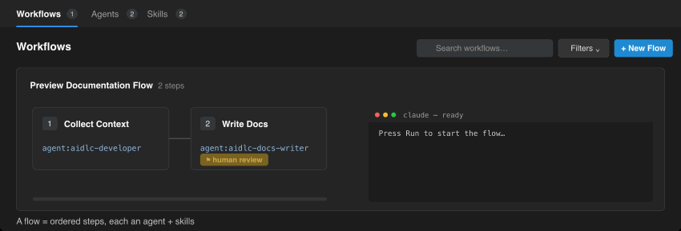
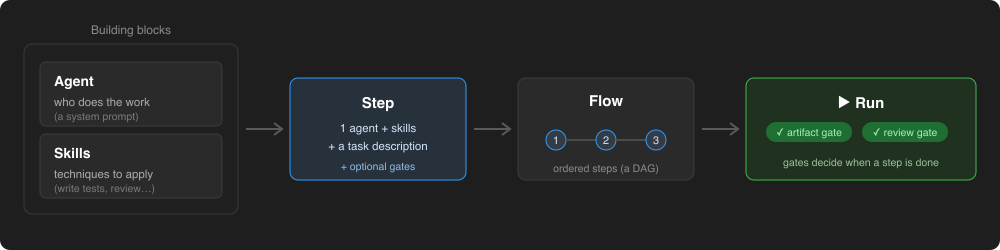
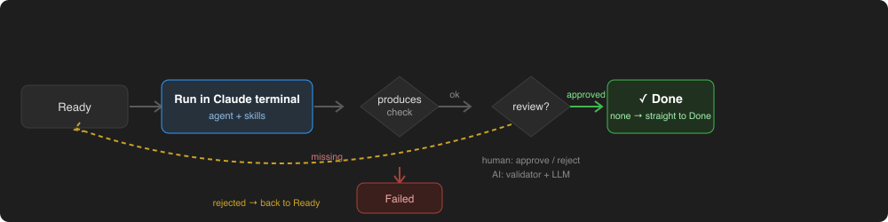

# AI StepFlow

**Run your Claude agents, skills, and multi-step workflows from inside VS Code** —
build a flow, run each step through the Claude CLI, and gate it on files or review.



## The idea



Compose reusable **agents** (*who* does the work) and **skills** (*how* — the
technique) into **steps**; wire steps into a **flow** (a dependency graph); then
**run** it — **gates** decide when each step is done. Agents and skills are just
markdown files in `~/.claude` (global) or `.claude` (per project).

## Features

- 🗂️ **One cockpit** — global and project agents, skills, and flows side by side.
- 🧩 **Visual flow builder** — agent + skills per step, set dependencies, drag to reorder.
- ▶️ **Step runner** — each step runs in a Claude terminal; output streams into the console.
- ✅ **Gates** — artifact (`requires` / `produces`) and review (human approve/reject or AI).
- 💾 **Run persistence** — in-progress runs are saved per project and restored on reload.
- 🖥️ **Headless CLI** — drive a flow from scripts or CI.
- 🔗 **GitNexus** *(optional)* — repo knowledge graph and multi-repo groups.

## Getting started

1. Install the Claude CLI: `npm install -g @anthropic-ai/claude-code`
2. Open the **AI StepFlow** icon in the activity bar (or run **AI StepFlow: Open Cockpit**).
3. Run **AI StepFlow: Install Default Agents & Skills**, then press **+ New Flow** → **Run**.

## How a step runs



A step opens an interactive Claude terminal (its agent + primary skill pre-filled).
It **starts** once its `dependsOn` steps are `done` and every `requires` file
exists; it **finishes** once every `produces` file/marker exists and the review
gate passes.

> **Permissions / known limitation.** Steps run with Claude's normal interactive
> permissions — only run flows you trust and review the diff. `trustLevel: sandboxed`
> is **not currently enforced** on the interactive path (it is implemented in the
> headless runner but unwired since steps moved to the terminal); treat sandboxed
> flows as unrestricted until this is rewired.

## CLI

The packaged extension exposes an `ai-stepflow` command for headless runs:

```sh
ai-stepflow run       --project . --flow .claude/flows/example.yaml --input feature=login
ai-stepflow verify    --project . --flow .claude/flows/example.yaml --run .claude-flow/runs/example-run.json
ai-stepflow report    --project . --flow .claude/flows/example.yaml --run .claude-flow/runs/example-run.json
ai-stepflow approve   --project . --flow .claude/flows/example.yaml --run .claude-flow/runs/example-run.json --step review
ai-stepflow mark-done --project . --flow .claude/flows/example.yaml --run .claude-flow/runs/example-run.json --step implement
```

`run` exits `3` at a human gate it cannot complete headlessly. `verify` re-checks
produced files against a saved run; `report` writes a markdown report.

## GitNexus *(optional)*

[GitNexus](https://www.npmjs.com/package/gitnexus) builds a per-repo knowledge
graph (symbols, call edges, flows) and can link repos into a group. Install it,
then a GitNexus row appears in **Project Settings**:

```sh
npm install -g gitnexus
claude mcp add gitnexus -- gitnexus mcp
```

## Commands

All commands live under the **AI StepFlow** category in the Command Palette.

| Command | Description |
| --- | --- |
| `AI StepFlow: Open Cockpit` | Open the cockpit |
| `AI StepFlow: Refresh All` | Reload agents, skills, and flows from disk |
| `AI StepFlow: Install Default Agents & Skills` | Install the bundled SDLC agents, skills, and rules into `~/.claude` |
| `AI StepFlow: Rescan AST Graph` | Re-index the workspace with `ast-graph` |
| `AI StepFlow: Re-register AST Graph MCP Server` | Re-register the `ast-graph` MCP server |

## License

MIT — see [LICENSE](./LICENSE).
